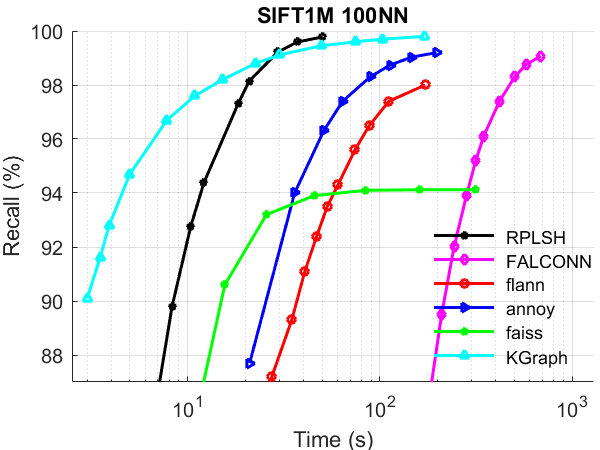
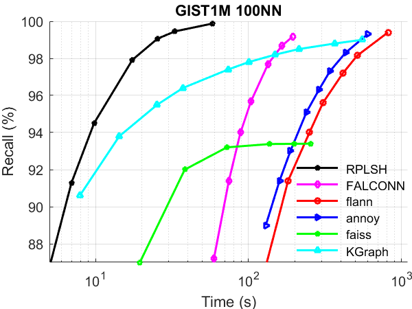

Random Projection based Locality Sensitive Hashing 
============
We provide here the codes for Kmeans Quantization + Random Projection based Locality Sensive Hashing (RPLSH). The LSH algorithm is formally described in [1] and the matlab version can be found at [here](https://github.com/ZJULearning/MatlabFunc/tree/master/ANNS/Hashing)

RPLSH is extremely simple but rather effective. All the previous hashing papers failed to correctly measure the performance of hashing algorithms and the powerfulness of RPLSH was certainly underestimated.
Please see our paper [A Revisit of Hashing Algorithms for Approximate Nearest Neighbor Search](http://arxiv.org/abs/1612.07545) for details.

Benchmark data set
-------
* [SIFT1M and GIST1M](http://corpus-texmex.irisa.fr/)

The performance was tested without parallelism.   

ANN search results
------

     
    

How To Complie    
-------
Go to the root directory of RPLSH and make.    

	cd RPLSH/
	make

How To Use    
------

* Index building

		cd RPLSH/samples/
		./index data_file index_file nCluster nIter tableNum

  Meaning of the parameters:   

        nCluster -- parameter for kmeans, how many partitions will be generated
        nIter    -- iteration number for kmeans
        tableNum -- the actual code length will be tableNum*32 bits

* Search with the builded index

		cd RPLSH/samples/
        ./search index_file data_file query_file result_file nGroup initsz querNN

  Meaning of the parameters:   

	    nGroup -- the number of nearest groups will be considered.   
    	initsz -- the number of points closest to query in the hamming space will be examined.    
	    querNN -- required number of returned neighbors   

Output and Input format
------
Same as that of [EFANNA](https://github.com/fc731097343/efanna)

Parameters to get the index in above Fig. 
------

Indexing:

        RPLSH/samples/index sift_base.fvecs sift.index 1000 100 32
        RPLSH/samples/index gist_base.fvecs gist.index 1000 100 32

Searching:

        RPLSH/samples/search sift.index sift_base.fvecs sift_query.fvecs result 5 100 100
        RPLSH/samples/search sift.index sift_base.fvecs sift_query.fvecs result 5 200 100
        RPLSH/samples/search sift.index sift_base.fvecs sift_query.fvecs result 8 300 100
        RPLSH/samples/search sift.index sift_base.fvecs sift_query.fvecs result 10 400 100
        RPLSH/samples/search sift.index sift_base.fvecs sift_query.fvecs result 15 500 100
        RPLSH/samples/search sift.index sift_base.fvecs sift_query.fvecs result 20 700 100
        RPLSH/samples/search sift.index sift_base.fvecs sift_query.fvecs result 25 900 100
        RPLSH/samples/search sift.index sift_base.fvecs sift_query.fvecs result 30 1000 100
        RPLSH/samples/search sift.index sift_base.fvecs sift_query.fvecs result 40 2000 100
        RPLSH/samples/search sift.index sift_base.fvecs sift_query.fvecs result 50 2000 100
        RPLSH/samples/search sift.index sift_base.fvecs sift_query.fvecs result 70 3000 100
        RPLSH/samples/search sift.index sift_base.fvecs sift_query.fvecs result 100 3000 100
        RPLSH/samples/search sift.index sift_base.fvecs sift_query.fvecs result 100 7000 100

        RPLSH/samples/search gist.index gist_base.fvecs gist_query.fvecs result 5 300 100
        RPLSH/samples/search gist.index gist_base.fvecs gist_query.fvecs result 8 400 100
        RPLSH/samples/search gist.index gist_base.fvecs gist_query.fvecs result 10 600 100
        RPLSH/samples/search gist.index gist_base.fvecs gist_query.fvecs result 15 800 100
        RPLSH/samples/search gist.index gist_base.fvecs gist_query.fvecs result 25 2000 100
        RPLSH/samples/search gist.index gist_base.fvecs gist_query.fvecs result 30 3000 100
        RPLSH/samples/search gist.index gist_base.fvecs gist_query.fvecs result 40 4000 100
        RPLSH/samples/search gist.index gist_base.fvecs gist_query.fvecs result 50 5000 100
        RPLSH/samples/search gist.index gist_base.fvecs gist_query.fvecs result 70 7000 100
        RPLSH/samples/search gist.index gist_base.fvecs gist_query.fvecs result 100 10000 100
        RPLSH/samples/search gist.index gist_base.fvecs gist_query.fvecs result 150 20000 100
        RPLSH/samples/search gist.index gist_base.fvecs gist_query.fvecs result 200 30000 100
        RPLSH/samples/search gist.index gist_base.fvecs gist_query.fvecs result 250 40000 100
        RPLSH/samples/search gist.index gist_base.fvecs gist_query.fvecs result 300 80000 100

[1]: Moses S. Charikar: Similarity estimation techniques from rounding algorithms. Proceedings of the thiry-fourth annual ACM symposium on Theory of computing, 2002.
